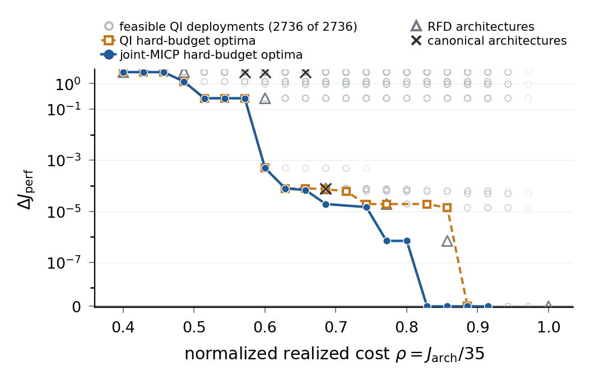

# CoDeCA: L-CSS paper reproduction

**Deployment-Aware Controller and Control Architecture Co-Design via Mixed-Integer Output-Feedback SLS**  
Chenchen Zhou and Jose Matias  
*IEEE Control Systems Letters*, vol. 10, pp. 2431–2436, 2026.

[**Published paper · L-CSS**](https://doi.org/10.1109/LCSYS.2026.3731917) · [**arXiv**](https://arxiv.org/abs/2606.14966) · [Original software archive](https://doi.org/10.5281/zenodo.21757462)

A small, self-contained implementation of the paper's three-follower platoon
example. The design selects actuators, sensor packages and directed communication
services together with an output-feedback controller under a deployment budget.



## Reproduce the figure

Use Python 3.12. Open a terminal in this folder and run:

```sh
python -m pip install matplotlib==3.10.3
python reproduce.py
```

This redraws Figure 1 from the published numerical records. It writes
`figure1.png`, `figure1.pdf`, `budget_summary.csv` and `sensitivity.csv` to
`results/`. It takes no optimization step and needs no Gurobi license.

## Recompute the experiments

Install the numerical dependencies and configure a Gurobi license:

```sh
python -m pip install -r requirements.txt
python reproduce.py solve
```

The full run computes the 22 co-design budgets, all 2,736 PBH-admissible QI
deployments, six canonical patterns and their QI repairs, the native RFD path,
and the sensitivity cases. The QI budget frontier is extracted from the
exhaustive fixed-deployment results. This is the expensive step.

Each completed QP is saved to `results/computed.json`; repeating the command
resumes that file. An interrupted RFD regularization path restarts its 16 SOCPs.
A different output folder starts an independent run:

```sh
python reproduce.py solve --section codesign --output results/my_run
python reproduce.py solve --section qi --output results/my_run
python reproduce.py solve --section canonical --output results/my_run
python reproduce.py solve --section rfd --output results/my_run
python reproduce.py solve --section sensitivity --output results/my_run
python reproduce.py figure --source results/my_run/computed.json --output results/my_run
```

## Read the implementation

There are six Python files, with no package installation or test framework.

| File | Purpose |
| --- | --- |
| [reproduce.py](reproduce.py) | Command-line entry point |
| [platoon.py](platoon.py) | Plant matrices, deployment costs, timing, PBH and QI conditions |
| [synthesis.py](synthesis.py) | OF-SLS mixed-integer QP, fixed-deployment QP and residual checks |
| [experiments.py](experiments.py) | Paper experiment grids and resumable results |
| [rfd.py](rfd.py) | Native hardware/service regularization, thresholding and QI completion |
| [plot_results.py](plot_results.py) | Figure and numerical summaries |

Start with `plant()` and `sls_residuals()` in `platoon.py`, then `build_model()`
in `synthesis.py`. The four response blocks are `R`, `M`, `N`, `L`.
Communication matrices use **[destination, source]**; `None` in JSON means no
service. The physical timing is explicit in `service_entries()`.

The main case has 9 states, 3 actuators, 7 sensor packages and a horizon of 10.
Hardware costs one unit per device. Remote service delays of 1 and 2 steps cost
3 and 2 units; the sensitivity case adds a 3-step service costing one unit.
Budgets range from 14 to 35. The random seed is 23 and Gurobi uses one thread.

The implementation retains the numerical checks needed to interpret a result:
OF-SLS and deployment residuals, independent fixed-QP synthesis of each integer
solution, and upper/lower-bound agreement. An unresolved solver status is saved
as such. A partial QI catalogue is not plotted as the exhaustive comparison.

## Reference results and citation

[data/reference.json](data/reference.json) contains the paper-relevant original
results, including residual summaries and the 176-point RFD path. At budget 24,
the co-design performance loss relative to the dense reference is
`1.92256e-5`, versus `7.41246e-5` for QI. The dense reference is
`J = 4.987426757285976`; the figure normalizes realized cost by 35.

This shorter implementation was checked against the original plant, constraint
and objective matrices, QI catalogue, RFD formulation, and saved figure data.
The complete optimization campaign has **not** been rerun for this refactor.
The original full records and implementation remain available in
[the preserved source revision](https://github.com/Daakuang/CoDeCA-LCSS-repro/tree/8bf329026e158fb281511ab3109135d429e141f0)
and the [v1.0.0 archive](https://doi.org/10.5281/zenodo.21757462).

```bibtex
@article{Zhou2026Deployment,
  author  = {Chenchen Zhou and Jose Matias},
  title   = {Deployment-Aware Controller and Control Architecture Co-Design
             via Mixed-Integer Output-Feedback SLS},
  journal = {IEEE Control Systems Letters},
  volume  = {10},
  pages   = {2431--2436},
  year    = {2026},
  doi     = {10.1109/LCSYS.2026.3731917}
}
```
